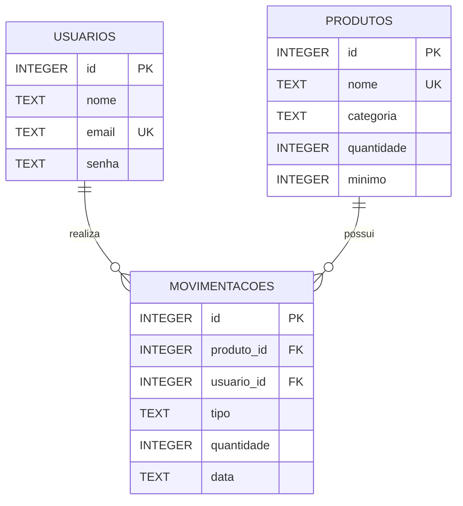

# Entrega 2 — Diagrama de Entidade e Relacionamento (DER)

## Modelo de dados

O banco de dados do sistema é composto por três entidades principais: `usuarios`, `produtos` e `movimentacoes`. A estrutura está alinhada ao script SQL existente no projeto.

## Entidades

### Usuários
Armazena os usuários que podem realizar operações no sistema.

- `id`: chave primária e identificador do usuário.
- `nome`: nome do usuário.
- `email`: e-mail único do usuário.
- `senha`: senha utilizada na autenticação.

### Produtos
Armazena os itens controlados pelo estoque.

- `id`: chave primária do produto.
- `nome`: nome único do produto.
- `categoria`: categoria do produto.
- `quantidade`: quantidade atual disponível.
- `minimo`: quantidade mínima definida para alerta de estoque.

### Movimentações
Registra entradas e saídas de produtos.

- `id`: chave primária da movimentação.
- `produto_id`: referência ao produto movimentado.
- `usuario_id`: referência ao usuário que realizou a operação.
- `tipo`: tipo da movimentação (`entrada` ou `saida`).
- `quantidade`: quantidade movimentada.
- `data`: data e hora da movimentação.

## Relacionamentos

- Um **usuário** pode realizar várias **movimentações**.
- Um **produto** pode possuir várias **movimentações**.
- Cada **movimentação** pertence a um único usuário e a um único produto.

> Observação: as chaves estrangeiras estão explicitamente definidas na inicialização do banco em `src/database/sqlite.js` e a estrutura das três tabelas também está documentada em `schema.sql`.
